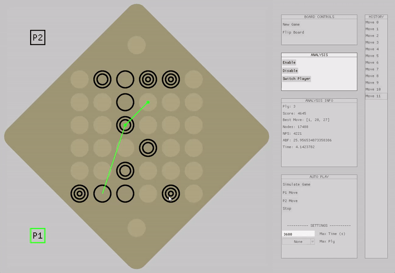

# Overview
A complete application for interacting with the [Gyges UGI Engine](https://github.com/Beck-Bjella/Gyges/tree/main).
- Fully interactable board with drag-and-drop functionality.
- Analysis and move suggestions with the engine.
- Play and simulate games against the engine.
  

# Installation
Download the latest release from the releases page and unzip it. 

Run the executable file named `gygesUI.exe` to start the application. 

NOTES: 
- The engine executable file `gyges_engine.exe` must be in the same directory as the UI executable file. This is, by default, included in the release.
- The release is complied for the x86-64 architecture and no guarantees are made for other architectures. If you are on another architecture, you will need to compile the application from the source code.

# Features & Usage
Drag and drop pieces to make moves. No move validation is done by the UI, so make sure to follow the game's rules. This allows for more flexibility in testing and playing with the engine. Below is a description of the different settings that can be found on the right side of the UI.

### Board Controls
- **New Game**: Reset the board to the starting position and clear the history.
- **Flip Board**: Rotate the board 180 degrees to view from the other side.

### Analysis
The engine will analyze the position without restrictions, searching until disabled.
- **Enable**: Start the engine analyzing the position. The green arrow indicates the current best move.
- **Disable**: Stop the engine's analysis.
- **Switch Player**: Switch the player the engine is analyzing for. Indicated by the lime highlighting.

### Auto Play
All of the auto-play options use the engine to make moves automatically. The engine uses the settings at the bottom of this section on the UI for all auto-play actions.

- **Start**: Start an auto-playing game using the engine for both players. This game will start with the current position and continue until the end of the game.
- **P1 Move**: Automatically make a move for player 1.
- **P2 Move**: Automatically make a move for player 2.
- **Stop**: Stop any auto-play actions.
  
- **Settings**: 
 - **Ply**: The depth to which the engine will analyze.
 - **MaxTime**: The maximum time the engine will use.

### History
You can jump to any point in the game history using the history window by selecting a move from the list.

Arrow keys can also be used to move through the game's history.
- **Undo**: Use the left arrow key to undo the last move. If you hold the key, you can view the undone move.
- **Redo**: Use the right arrow key to redo the last move. If you hold the key, you can view the move to be redone.

# Contributions
Contributions are welcome! Please open an issue or pull request for suggestions or improvements.

# License
This application is released under the GNU General Public License v3.0. Please review and comply with the license terms when using or distributing the application.
